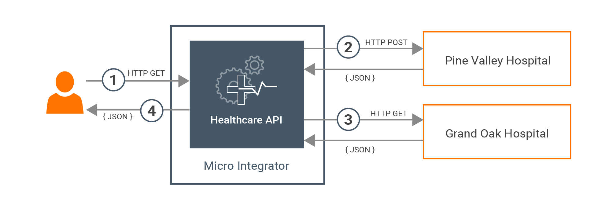

Developing Your First Integration Solution¶

Integration developers need efficient tools to build and test all the integration use cases required by the enterprise before pushing them into a production environment. The following topics will guide you through the process of building and running an example integration use case using WSO2 Integration Studio. This tool contains an embedded WSO2 Micro Integrator instance as well as other capabilities that allows you to conveniently design, develop, and test your integration artifacts before deploying them in your production environment.

> **_NOTE:_** Please wait until the playground is ready to start the scenario.